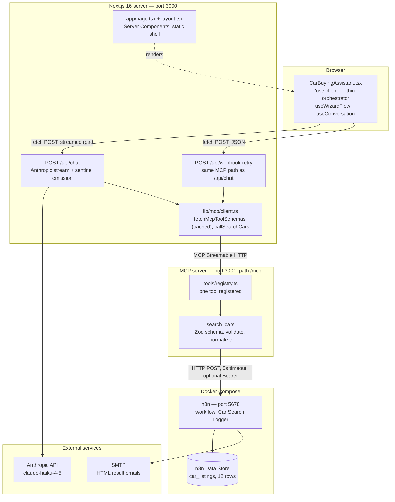
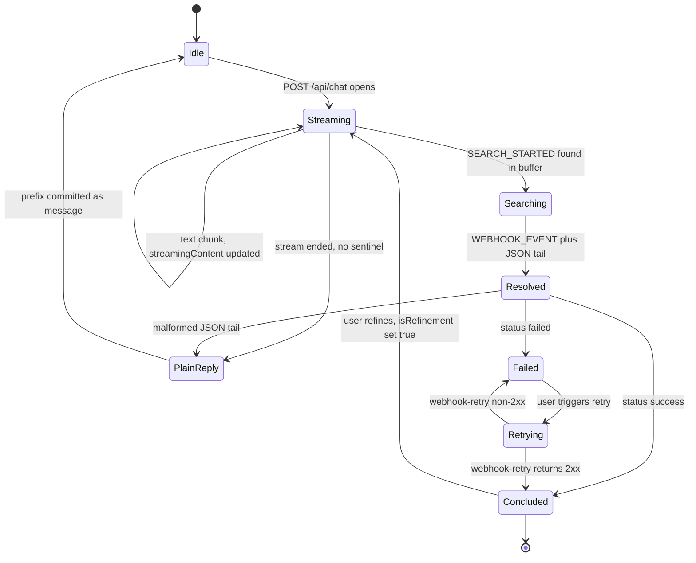
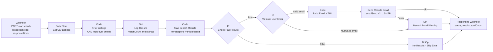
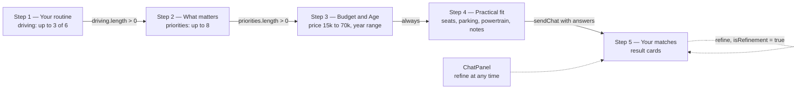

# Architecture — AI Car Buying Assistant

## 1. What this is

A guided car-shopping assistant. The user answers four short lifestyle questions in a wizard
("What does a normal week on the road look like?" rather than "What engine displacement?"), and
an LLM translates those answers into structured search filters, runs a vehicle search, and
returns a shortlist. The in-app assistant is named **Cora**.

The value flow:

```
wizard (4 steps)  →  Claude builds filters  →  MCP validates  →  n8n filters listings
                  →  email full list        →  step 5 shows top 5 cards in the UI
```

Two design decisions dominate everything else in this document:

1. **The search tool lives behind an MCP server**, not inside the Next.js route. The route asks
   the MCP server for the tool's JSON Schema at request time, so the schema has exactly one
   definition (`mcp-server/tools/search-cars.ts`).
2. **There is no agentic tool loop.** One Anthropic streaming call happens per request, and the
   search result is *never* fed back to the model as a `tool_result`. 

---

## 2. System at a glance



The **Next.js app is not in Docker Compose** — only `n8n` and `mcp-server` are. In practice the
app and often the MCP server run on the host while n8n runs in a container.

Both routes reach n8n through the same MCP path, so validation, auth, and normalization apply
identically to an original search and to a retry.

---

## 3. Processes, ports, and how to run

| Process | Entry point | Port | Command |
|---|---|---|---|
| Next.js 16 App Router, React 19 | `app/` | 3000 | `npm run dev` |
| MCP server | `mcp-server/index.ts` | 3001, path `/mcp` | `npm run dev:mcp` |
| n8n | `docker-compose.yml` | 5678 | `docker compose up` |
| Anthropic API | — | — | model `claude-haiku-4-5`, `max_tokens: 1500` |
| SMTP | — | — | credential configured in the n8n UI only |

`npm run dev:mcp` is `tsx --env-file=.env.local mcp-server/index.ts` — the MCP server reads env
directly from `.env.local`, it does not go through Next.js. `npm run typecheck` (`tsc --noEmit`)
covers the app and the MCP server in one pass, since both live under the same `tsconfig.json`.

There is no build step for the MCP server in either dev or Docker; `mcp-server/Dockerfile` runs
`./node_modules/.bin/tsx mcp-server/index.ts` as the non-root `node` user, and copies `lib/` in
because `mcp-server/` imports from it. It runs `npm ci` (not `--omit=dev`) because `tsx` is a
devDependency needed at runtime.

**Startup order matters.** The chat route calls `fetchMcpToolSchemas()` before it calls Anthropic,
and that function *throws* if `MCP_SERVER_URL` is unset. If the MCP server is down, every chat
request fails with HTTP 502 `api_error` — the app has no tool-less fallback. Compose gates
`mcp-server` on an n8n healthcheck, so the container does not start before n8n can answer.

---

## 4. Request lifecycle


Note steps 3–4: the `tools/list` round trip is **skipped when the schema cache is warm** (60 s
TTL), so a typical request makes one MCP round trip rather than two. Each still opens and closes a
fresh transport (see §6).

### The system prompt

`buildSystemPrompt(isRefinement, wizardAnswers)` (`app/api/chat/route.ts:10-48`) has four
branches, selected by the two flags. All four share the same base — *"You are a car buying
advisor. Only engage with car-related topics"* — and all four push hard toward calling the tool
immediately rather than conversing:

| `wizardAnswers` | `isRefinement` | Behaviour |
|---|---|---|
| yes | yes | one sentence confirming the adjustment, then `search_cars` with updated params |
| yes | no | `search_cars` immediately; no questions unless the notes are ambiguous |
| no | yes | one sentence confirming, then `search_cars`; no further questions |
| no | no | one sentence, then `search_cars` using only mentioned params; rest `null`/`"any"` |

When wizard answers are present they are interpolated as a plain-text preferences block
(`app/api/chat/route.ts:13-23`) — driving patterns, priorities, budget, year range, seats, parking,
powertrain, notes. This is why the wizard exists: it front-loads the information the model would
otherwise have to ask for, so the very first turn can call the tool.

---

## 5. The streaming sentinel protocol

This is the least obvious part of the system and the thing worth understanding first.

`/api/chat` returns `Content-Type: text/plain; charset=utf-8` wrapping a raw `ReadableStream`
(`app/api/chat/route.ts:153-155`). **It is not SSE, not JSON, not newline-delimited JSON.**
Control information is smuggled into the text stream as two magic strings:

```
<Claude's text tokens, enqueued verbatim>
\n\n__SEARCH_STARTED__                             (before callSearchCars)
   … silent gap while MCP → n8n runs …
\n\n__WEBHOOK_EVENT__{"status":"success", …}
```

Both literals live in **one place**: `lib/constants/sentinels.ts` exports
`SENTINEL_SEARCH_STARTED` and `SENTINEL_WEBHOOK_EVENT`, imported by both
`app/api/chat/route.ts` and `hooks/useConversation.ts`. Renaming one now changes both sides.

### How the client decodes it

`sendChat()` in `hooks/useConversation.ts` reads with `response.body.getReader()` and a
`TextDecoder`, accumulating into one buffer. On every chunk it finds the **earliest** of the two
markers and renders only the prefix:

```ts
const webhookIdx = accumulated.indexOf(SENTINEL_WEBHOOK_EVENT);
const searchStartedIdx = accumulated.indexOf(SENTINEL_SEARCH_STARTED);
const markers = [webhookIdx, searchStartedIdx].filter((i) => i !== -1);
const firstMarker = markers.length > 0 ? Math.min(...markers) : -1;

setStreamingContent(firstMarker !== -1 ? accumulated.slice(0, firstMarker) : accumulated);
setIsSearching(searchStartedIdx !== -1);
```

After the stream closes it splits on `__WEBHOOK_EVENT__` and `JSON.parse`s the tail into a
`WebhookEvent`. Four outcomes:

- **`status: 'success'`** — commit prefix text as an assistant message, `setSearchResults`,
  `setTotalResultCount`, `setSessionStatus('concluded')`, then call `onSearchResolved()` which
  the orchestrator wires to `useWizardFlow`'s `jumpToResults()`.
- **`status: 'failed'`** — stash `retryPayload` in `retryPayloadRef`, show `webhookError` with a
  retry affordance.
- **Malformed JSON tail** — the prefix text becomes an assistant message; the raw tail is
  discarded rather than rendered.
- **No sentinel at all** — the whole buffer becomes an assistant message. This is the
  plain-conversation path.

### Errors after the headers are sent

The Anthropic stream is consumed **inside** `ReadableStream.start()`, which runs after the `200`
has been committed. A throw there does *not* reach the route's enclosing `try/catch`, so it cannot
become an HTTP error status — left unhandled it becomes an unhandled rejection, the connection
drops, and the client waits forever.

The route therefore wraps the whole stream body and reports failures *inside* the stream: any
upstream error (rate limit, budget, connection drop, overload) and any unparseable `tool_use` JSON
is emitted as a `status: 'failed'` `__WEBHOOK_EVENT__` carrying the same user-facing copy the
pre-stream path would have returned. `describeUpstreamError()` is shared by both paths, so the
message a user sees does not depend on *when* the failure happened.

This means a failed chat request can legitimately return `200` with a failure event in the body.
Only failures *before* the stream opens — notably `fetchMcpToolSchemas()` — produce a 4xx/5xx.

### Protocol state machine



### Why this shape, and what it costs

The route intercepts the tool call mid-stream and resolves it server-side, so the user sees
Claude's confirmation sentence immediately and a loading state during the n8n round trip —
without a second model call. The trade-off is that the model has no knowledge of the results: it
cannot rank them, explain them, or answer follow-up questions about them. All presentation logic
lives in React (`components/Results.tsx`).

---

## 6. The MCP layer

### Server

`mcp-server/index.ts` is a bare `node:http` server, not a framework:

- Requests to any path other than `/mcp` get a 404.
- A malformed JSON body gets a 400 rather than throwing out of the request handler.
- Transport is `StreamableHTTPServerTransport` with `sessionIdGenerator: undefined`, i.e. **fully
  stateless** — no session IDs, no shared state.
- A **new `McpServer` and a new transport are constructed per HTTP request**, both closed on
  `res.close`.
- Binds `0.0.0.0`, so the published Docker port `3001:3001` reaches the process.
- Server identity: `name: 'vehicle-search-mcp-server', version: '1.0.0'`.
- Every request is logged as `[mcp] → <method> (<toolName>)`.

### Registry

`mcp-server/tools/registry.ts` is six lines and delegates to one registration function. Tool
name → handler dispatch happens entirely inside the MCP SDK; there is no custom dispatch map.

```ts
export function registerTools(server: McpServer): void {
  registerSearchCarsTool(server);
}
```

Adding a tool means writing a `register*Tool(server)` function and adding one line here. It then
appears automatically in the model's tool list, because the route fetches schemas via
`listTools()` rather than hard-coding them.

### Client

`lib/mcp/client.ts` exposes two functions. Neither pools connections — each builds a fresh
`Client` + `StreamableHTTPClientTransport`, connects, acts, and closes in a `finally` block.

`fetchMcpToolSchemas()` performs the MCP → Anthropic schema conversion, which is a pure
property rename with no transformation:

```ts
return tools.map((tool) => ({
  name: tool.name,
  description: tool.description,
  input_schema: tool.inputSchema as Anthropic.Tool['input_schema'],
}));
```

Its result is **cached at module scope for 60 seconds**, so a warm chat request makes only one
MCP round trip (`tools/call`) instead of two. The TTL means a redeployed MCP server is picked up
without restarting Next.js.

`callSearchCars()` returns an `ErrorEnvelope` rather than throwing — including for a non-JSON
tool response (`SCHEMA_MISMATCH`) and an unset `MCP_SERVER_URL` (`MCP_NOT_CONFIGURED`).

### The `search_cars` tool

Input schema — 14 Zod fields. Only three are required:

| Field | Type | Req. | Notes |
|---|---|:--:|---|
| `budgetMax` | `number \| null` | | maximum budget in euros |
| `bodyTypes` | `string[]` | | `["any"]` for no constraint |
| `fuelTypes` | `string[]` | | |
| `transmission` | `'manual' \| 'automatic' \| 'any'` | ● | |
| `minSeats` | `number \| null` | | |
| `features` | `{ name, mandatory }[]` | | mandatory vs nice-to-have |
| `yearMin` / `yearMax` | `number \| null` | | |
| `engineDisplacements` | `string[]` | | e.g. `["1.5","2.0"]` |
| `usageContext` | `'commute' \| 'family' \| 'offroad' \| 'performance' \| 'any'` | ● | |
| `annualMileage` | `string \| null` | | e.g. `"10000-15000"` |
| `endTrigger` | `'explicit' \| 'implicit' \| 'length-limit' \| 'refinement' \| 'unknown'` | ● | provenance of the call |
| `isRefinement` | `boolean` | | *"Injected by route handler — not filled by Claude"* |
| `userEmail` | `string \| null` | | *"Injected by route handler — not filled by Claude"* |

The last two are in the schema the model sees but are described as route-injected. They must stay
in the Zod schema — the SDK strips keys absent from it — and the route overwrites whatever the
model supplies, so a model-provided value is always discarded.

**Allowed enum members**, enforced by `validateSearchFilters`. These are deliberately narrowed to
exactly what the n8n Data Store can hold, so an unmatchable filter fails loudly instead of
returning a silent zero-result search:

- body types — `hatchback saloon estate suv coupe any`
- fuel types — `petrol diesel hybrid electric any`
- displacements — `1.0 1.2 1.4 1.5 1.6 1.8 2.0 2.5 3.0 any`

Validation collects *all* errors before returning: `budgetMax > 0`, enum membership, years
integral within `[1900, currentYear + 1]`, `yearMin <= yearMax`, `minSeats` integer `>= 1`,
non-empty feature names. Enum failures name the allowed values in the message so the model can
self-correct. This is the layer spec 009 introduced — the whole reason the MCP server exists is
to stop malformed model output from reaching n8n.

**Execution**: log a filter summary → validate → read `N8N_WEBHOOK_CAR_SEARCH_URL` → build a
`CarSearchPayload` with `?? null` / `?? ['any']` defaults → POST with `AbortSignal.timeout(5000)`
and an optional `Authorization: Bearer` header → normalize.

**Normalization** is defensive throughout: non-object bodies and a missing `results` array become
`SCHEMA_MISMATCH`; individual items missing a string `make`, string `model`, or numeric `year` are
**dropped with a warning** rather than failing the request; and every optional field
(`mileage`, `features`, `fuelType`, `seatCount`, `transmission`, `imageUrl`, `bodyType`, `price`,
`sourceUrl`) is `typeof`/`Array.isArray` guarded, so a field n8n omits arrives as `null` (or `[]`
for `features`) rather than `undefined`. The synthesized `id` is
`` `${make}-${model}-${year}-${index}` ``, so duplicate listings still get distinct React keys.
`totalCount` falls back to `results.length` when absent — so `totalCount` can legitimately exceed
`results.length` when n8n reports a larger total than it returns.

**Error envelope** (`lib/types/mcp.ts`), discriminated by `isErrorEnvelope`:

| `code` | Cause |
|---|---|
| `VALIDATION_ERROR` | filters failed `validateSearchFilters` |
| `MCP_NOT_CONFIGURED` | `MCP_SERVER_URL` unset (raised by the Next.js-side client) |
| `N8N_UNREACHABLE` | webhook URL unset, or network error |
| `TIMEOUT` | n8n exceeded 5 seconds |
| `N8N_ERROR` | n8n returned non-2xx |
| `SCHEMA_MISMATCH` | body not JSON, not an object, no `results` array, or a non-JSON MCP tool response |

The route maps any envelope to `WebhookEvent { status: 'failed', errorMessage, retryPayload }`,
so all six codes surface to the user as one retryable error.

---

## 7. The n8n workflow

Workflow name **"Car Search Logger"**, webhook path `/webhook/car-search`.

The live graph is committed at **`n8n/car-search-workflow.json`** (exported from the running
instance). `n8n/README.md` covers importing it after a volume reset and the two things an export
cannot carry — the SMTP credential and the `car_listings` Data Store rows.



| Node | Type | Role |
|---|---|---|
| Webhook | `n8n-nodes-base.webhook` v2 | entry; `responseMode: responseNode` so the caller gets a body back (changed from `onReceived` in spec 008) |
| Get Car Listings | `n8n-nodes-base.dataTable` v1.1 | `returnAll: true` — reads **all** `car_listings` rows; no read-time filter |
| Code: Filter Listings | `n8n-nodes-base.code` v2 | AND-logic filter; `"any"` / `[]` criteria are no-ops; only **mandatory** features are enforced |
| Set: Log Results | `n8n-nodes-base.set` v3.5 | surfaces `matchCount`, `listings`, `searchCriteria`, `noResults` in the execution view |
| Code: Map Search Results | `n8n-nodes-base.code` v2 | maps Data Store rows to the `VehicleResult` field names the app expects (`source` → `sourceUrl`) and computes `totalCount` |
| IF: Check Has Results | `n8n-nodes-base.if` v2.3 | branches on `matchCount > 0` |
| IF: Validate User Email | `n8n-nodes-base.if` v2.3 | regex-checks `body.userEmail` before attempting delivery |
| Code: Build Email HTML | `n8n-nodes-base.code` v2 | table-based XHTML email: criteria summary + one card per listing |
| Send Results Email | `n8n-nodes-base.emailSend` v2.1 | subject `"Your car matches: N result(s) found"`; `onError: continueErrorOutput` so delivery failure never fails the search |
| Set: Record Email Warning | `n8n-nodes-base.set` v3.5 | reached from either a missing/invalid address or a send failure |
| NoOp: No Results - Skip Email | `n8n-nodes-base.noOp` | false branch of Check Has Results |
| Respond to Webhook | `n8n-nodes-base.respondToWebhook` v1.5 | terminal; returns `{ status, results, totalCount }` from Map Search Results |

`Log Query` (`n8n-nodes-base.code`) is also present in the workflow but **unconnected** — a spec
003 leftover that never executes. It is preserved in the export for fidelity; see `n8n/README.md`.

### The "database"

There is **no external database**. Storage is n8n's built-in **Data Store**, one table
`car_listings` with 12 seed rows, read-only at runtime and seeded manually through the n8n UI
(`specs/005-webhook-db-search/contracts/car-search-data-store.md`).

Columns: `id, make, model, year, price, mileage, fuelType, bodyType, transmission, seatCount,
colour, condition, features` (JSON string array)`, source`. Enums: `fuelType ∈ {petrol, diesel,
hybrid, electric}`, `bodyType ∈ {hatchback, suv, saloon, estate, coupe}`,
`transmission ∈ {manual, automatic}`, `condition ∈ {new, used}`.

The MCP tool's accepted `bodyTypes` / `fuelTypes` are kept **equal** to these Data Store enums
(§6), so every value that passes validation is one the store can actually match. Adding a body or
fuel type therefore means changing both the Data Store rows and `KNOWN_BODY_TYPES` /
`KNOWN_FUEL_TYPES` in `mcp-server/tools/search-cars.ts`.

---

## 8. Data model


Where each type lives, and the boundary it crosses:

| Type | File | Crosses |
|---|---|---|
| `WizardAnswers`, `Message`, `MessageParam`, `MessageRole`, `SessionStatus`, `ChatErrorType`, `ChatErrorResponse` | `lib/types/chat.ts` | browser ↔ route |
| `SearchFilters` | `mcp-server/types.ts` | **imported by the Next.js side** (`lib/mcp/client.ts`) — this file crosses the process boundary |
| `CarSearchPayload`, `SearchResultItem`, `WebhookEvent`, `FeatureEntry`, `WebhookResult` | `lib/types/n8n.ts` | route ↔ MCP ↔ n8n ↔ browser |
| `VehicleResult`, `NormalizedResponse`, `ErrorEnvelope`, `isErrorEnvelope` | `lib/types/mcp.ts` | MCP ↔ route |
| `SENTINEL_WEBHOOK_EVENT`, `SENTINEL_SEARCH_STARTED` | `lib/constants/sentinels.ts` | route ↔ browser |

`SearchResultItem` and `VehicleResult` are structurally identical except that `VehicleResult` adds
a synthesized `id` of the form `` `${make}-${model}-${year}-${index}` ``.

---

## 9. Frontend structure

`app/page.tsx` is five lines and does nothing but render `CarBuyingAssistant`; there is no
server-side data fetching anywhere. Everything below the page is client-side.



The gate is `canContinue` in `useWizardFlow` — steps 1 and 2 require a non-empty selection, steps
3 and 4 always pass. `continueFlow()` in `CarBuyingAssistant` fires `sendChat('', answers)` on the
`3 → 4` transition; the search *is* the step-5 transition. `maxStep` allows backward navigation
only to already-visited steps.

### File layout

| Path | Purpose |
|---|---|
| `components/CarBuyingAssistant.tsx` | default export; layout shell, wires the two hooks together, owns only `chatOpen` / `menuOpen` / `chatInputRef` |
| `components/ChatPanel.tsx` | chat drawer; owns `draft` and the autoscroll ref |
| `components/Results.tsx` | skeletons, empty state, `slice(0, MAX_DISPLAYED_RESULTS)` cards, heart-save |
| `components/layout/AppSidebar.tsx` | desktop step nav (`lg:flex`) + reset |
| `components/layout/MobileNav.tsx` | mobile drawer, same nav + backdrop |
| `components/layout/StepList.tsx` | the step tracker both of the above render, via a `variant` prop |
| `components/wizard/StepOne…StepFour.tsx` | the four wizard steps |
| `components/wizard/types.ts` | the shared `StepProps` contract |
| `components/ui/Logo.tsx` | brand mark, `compact` variant |
| `components/ui/ChoiceCard.tsx` | animated multi-select tile |
| `components/ui/SegmentedControl.tsx` | pill picker, shared-element `layoutId` |
| `components/ui/DualRangeSlider.tsx` | overlaid dual range inputs for year min/max |
| `hooks/useWizardFlow.ts` | step/answer state and navigation |
| `hooks/useConversation.ts` | streaming, the sentinel protocol, search results, retry |
| `lib/wizard/config.ts` | step copy, option lists, initial state, limits, error copy |

Nothing under `components/ui/` or `components/wizard/` touches conversation state, so each is
testable and reusable in isolation.

### State

State is split across the two hooks; there is still no reducer, context, or store.

**`useWizardFlow`** — `currentStep`, `maxStep`, `answers`, plus `mainScrollRef` for the
scroll-to-top on advance. Exposes `canContinue`, `goToStep`, `goBack`, `advance`,
`jumpToResults`, `resetWizard`.

**`useConversation`** — `messages`, `isStreaming`, `streamingContent`, `sessionStatus`,
`isRefinement`, `submittedWizardAnswers` (snapshot at submit time, so later refinements still
carry the original profile), `webhookError`, `isSearching`, `searchResults`, `totalResultCount`,
`userEmail`, plus `abortControllerRef` (cancels the in-flight `/api/chat` fetch on reset) and
`retryPayloadRef` (holds the failed `CarSearchPayload`). Exposes `sendChat`, `retryWebhook`,
`resetConversation`.

**How they compose without a cycle.** `useWizardFlow` has no knowledge of the conversation.
`useConversation` takes two callbacks — `onSearchResolved` (wired to `jumpToResults`) and
`onUserSend` (wired to opening the chat panel) — so the dependency runs one way only. The
orchestrator defines `continueFlow` and `resetFlow` by composing both hooks.

There is exactly **one `useEffect` in the whole tree** — autoscroll inside `ChatPanel`. Everything
else is event-driven. `isStreaming` and `isSearching` combine into `resultsLoading` to drive the
skeleton cards.

Notably, the wizard-triggered message is **synthetic**: `WIZARD_TRIGGER_MESSAGE` is appended to
the outgoing API messages but never stored in `messages`, so it never appears in the chat
transcript. Conversation history sent upstream is capped at `MAX_HISTORY_MESSAGES` (20) with
result-bearing messages filtered out.

### Styling

Tailwind v4 via `@import "tailwindcss"` in `app/globals.css`, imported from `app/layout.tsx`.
PostCSS uses only `@tailwindcss/postcss` (a devDependency). Animation is `framer-motion`, icons
are `lucide-react`. The two custom slider classes (`.budget-slider`, `.year-range-thumb`) live in
`globals.css` because range-input pseudo-elements cannot be expressed as utilities.

---

## 10. Configuration

| Variable | Read by | Purpose |
|---|---|---|
| `ANTHROPIC_API_KEY` | `app/api/chat/route.ts` | Anthropic SDK auth |
| `MCP_SERVER_URL` | `lib/mcp/client.ts` | where Next.js reaches MCP, e.g. `http://localhost:3001/mcp` |
| `MCP_SERVER_PORT` | `mcp-server/index.ts` | MCP bind port, default `3001` |
| `N8N_WEBHOOK_CAR_SEARCH_URL` | `mcp-server/tools/search-cars.ts` | n8n webhook endpoint |
| `N8N_WEBHOOK_AUTH_TOKEN` | `mcp-server/tools/search-cars.ts` | optional `Bearer` token |

`.env.local` defines all five. In Compose, `mcp-server` receives `MCP_SERVER_PORT=3001` and
`N8N_WEBHOOK_CAR_SEARCH_URL=http://n8n:5678/webhook/car-search` — the n8n **service hostname**,
not `localhost`. No `N8N_WEBHOOK_AUTH_TOKEN` is passed in Compose, so containerized runs send
unauthenticated webhook requests unless you add it to the `mcp-server` environment block.

Both paths to n8n now run through the MCP server, so `N8N_WEBHOOK_CAR_SEARCH_URL` only needs to be
reachable from the MCP process.

No `NEXT_PUBLIC_*` variables exist; no secret reaches the browser.

---

## 11. How the architecture evolved

The repo uses Spec-Kit: `specs/NNN-name/{spec,plan,data-model,research,tasks}.md` plus
`contracts/`. Read as a sequence, the specs explain why each layer exists.

| # | Feature | Why it exists |
|---|---|---|
| 001 | `app-skeleton-setup` | Next.js shell: single-page chat UI, 404, responsive layout |
| 002 | `ai-chatbot-integration` | wire the UI to Claude with token streaming and error handling |
| 003 | `n8n-integration` | stand up self-hosted n8n; fire-and-forget POST per chat turn |
| 004 | `smart-conversation-webhook` | **replace per-message firing with a structured tool call** — one `CarSearchPayload` at session end instead of a webhook per turn |
| 005 | `webhook-db-search` | give n8n something to search: `car_listings` Data Store + filter Code node |
| 006 | `expert-advisor-mode` | rewrite the system prompt so the model infers specs from lifestyle instead of interrogating the user |
| 007 | `email-notification-results` | HTML result email via n8n Send Email |
| 008 | `chat-search-feedback` | **the sentinel protocol** — n8n responds with a body, `__SEARCH_STARTED__` / `__WEBHOOK_EVENT__` bring results back into the chat |
| 009 | `mcp-vehicle-search` | **insert MCP as a validation boundary** between model and n8n; `search_cars` |
| 010 | `new-design-live-integration` | replace the chat-first page with the five-step wizard; feed `wizardAnswers` into `/api/chat` |
| 011 | `mcp-canonical-tool-layer` | route fetches tool schemas via `listTools()` each request — **MCP registry becomes the single source of truth** |
| 012 | `codebase-cleanup` | fix the §13 gaps: split the 1421-line monolith into components + hooks, guard every `JSON.parse`, route the retry through MCP, version-control the n8n workflow, delete dead code |

The through-line is progressive tightening of the model's authority: from "the model chats and we
fire a webhook every turn" (003) → "the model emits one structured payload" (004) → "a separate
process validates that payload before anything downstream sees it" (009) → "that process also
owns the schema the model is shown" (011) → "that boundary is the *only* way to reach n8n" (012).

---

## 12. Constitution constraints

`.specify/memory/constitution.md` (v1.0.0, ratified 2026-08-04) governs this codebase and
supersedes conflicting conventions. Condensed:

- **I. Clean Code** — self-explanatory identifiers; extract deeply nested logic; delete dead code
  immediately; Prettier-enforced formatting; **no commented-out code in committed files**.
- **II. Simple UX** — fewest possible steps; progressive disclosure; human-readable actionable
  errors, never raw technical output; defaults represent the common path.
- **III. Responsive Design** — correct at ≥320px, ≥768px, ≥1280px; fluid relative units;
  touch targets ≥44×44px; no horizontal scroll; mobile-first.
- **IV. Minimal Dependencies** — every dependency justified against: does the project already
  cover this, can a small custom implementation replace it, is it maintained and CVE-free.
- **V. No Automated Testing** — **no unit, integration, e2e, or snapshot suites; no test runners
  as dependencies; no CI test steps.** Quality comes from review and manual verification.

Stack rules: latest stable Next.js/React at feature start; App Router and Server Components
only; Pages Router and `getServerSideProps` forbidden; TypeScript everywhere; each unavoidable
`any` must carry a `// TODO: remove any` comment.

Principle V explains the absence of any `test/` directory, and is why §14 below is a manual
checklist rather than a test command.

---

## 13. Known gaps and drift

Observations from reading the code, not a work order. The thirteen gaps previously listed here
were all closed by spec 012; what follows is what remains.

1. **`Log Query` is an orphan node in the n8n workflow.** A spec 003 leftover, unconnected and
   never executed. It is preserved in `n8n/car-search-workflow.json` so an import reproduces the
   live graph exactly. Deleting it in the UI and re-exporting is the fix.

2. **Spec 007 T001 is still unchecked.** The SMTP credential must be created by hand in the n8n
   UI; nothing in the repo can carry it. Until it exists, `Send Results Email` fails and the
   workflow routes through `Record Email Warning` — searches still succeed, emails silently do
   not arrive. See `n8n/README.md`.

3. **`endTrigger` is carried but never acted on.** The model picks one of five values, it
   round-trips through `CarSearchPayload` into `WebhookEvent`, and nothing branches on it. It is
   provenance metadata for a decision the code does not yet make.

4. **`totalCount` can exceed `results.length` legitimately** (§6), and the UI's overflow copy
   assumes the difference means "more matches are in the email". If n8n ever returns a capped
   `results` array *without* sending an email, that copy would be wrong. Today n8n returns every
   match, so the two agree.

5. **`usageContext`, `annualMileage`, and `engineDisplacements` reach n8n but are not filtered
   on.** The `Filter Listings` Code node reads `budgetMin`/`budgetMax`, `bodyTypes`, `fuelTypes`,
   `transmission`, `minSeats`, and mandatory `features` only. The three unused fields pass
   validation, appear in the payload, and are ignored — so a user constraint the model faithfully
   captured has no effect on results.

6. **The MCP server has no request size limit.** `req.on('data')` accumulates chunks with no
   ceiling. Low risk for a loopback-adjacent internal service, but unbounded.

7. **No `lint` script and no linter.** `npm run typecheck` and `npm run build` are the gate;
   there is no ESLint config, so Constitution I's formatting rules rest on review alone.

8. **`lib/wizard/config.ts` couples copy to code.** Step text, option labels, and hints live in a
   TypeScript module, so a copy change is a code change. Fine at this size; worth noting if
   content ever needs to move.

---

## 14. Verification

Automated tests are forbidden by constitution principle V, so verification is manual.

**Static gate** (run before anything else — both must be clean)

```bash
npm run typecheck
npm run build
```

**Startup**

```bash
docker compose up -d          # n8n on :5678, then mcp-server once n8n is healthy
npm run dev:mcp               # or run the MCP server on the host instead
npm run dev                   # Next.js on :3000
```

Either MCP server works now that the process binds `0.0.0.0`. To confirm the containerized one is
reachable: `curl -s -o /dev/null -w '%{http_code}' localhost:3001/mcp` should return `400`
(malformed body rejected), not a connection refusal.

**End-to-end happy path**

1. Open `http://localhost:3000`, complete steps 1–4, click through to step 5.
2. Watch the MCP server log: expect `[mcp] → tools/list` on the first request only (the schema is
   then cached for 60 s), `[mcp] → tools/call (search_cars)`, `[search_cars] invoked — …` with a
   filter summary, then `[search_cars] ✓ N result(s) returned`.
3. In the browser Network tab, inspect the `/api/chat` response as raw text. Confirm the frame
   order from §5: prose, `__SEARCH_STARTED__`, then `__WEBHOOK_EVENT__` with a JSON tail.
4. Confirm the UI shows skeleton cards during the gap, then up to 5 result cards, and that the
   spec line under each title reads `suv · petrol / hybrid · automatic · 5 seats` — fuel types
   joined with ` / `, never a bare comma-separated array.
5. Check the n8n execution log for `matchCount`, and the inbox for the result email if an email
   was supplied.
6. Send a follow-up in the chat panel ("only hybrids") and confirm the results refresh in place.

**Failure paths**

- Stop the MCP server and send a chat message → expect HTTP 502 and the `api_error` copy.
- Stop n8n and search → expect `N8N_UNREACHABLE`, surfaced as `webhookError` with a retry button.
  Restart n8n, click **Try again**, and confirm **result cards now appear** — the retry commits
  its results rather than just clearing the error.
- Send an out-of-enum body type (e.g. ask for a convertible) → expect `VALIDATION_ERROR` whose
  `details` name the allowed values.
- `curl -X POST localhost:3000/api/chat -d '{}' -H 'Content-Type: application/json'` → expect
  **400**, not 500.
- Break `ANTHROPIC_API_KEY` and send a message → expect **HTTP 200** whose body is
  `__WEBHOOK_EVENT__{"status":"failed",…}`, and the error copy in the chat panel. A 500 here means
  a mid-stream throw escaped again (§5).
- `curl -X POST localhost:3001/mcp -d 'not json' -H 'Content-Type: application/json'` → expect
  **400** and the MCP process still alive.

**Responsive check (constitution III)** — verify at 320px, 768px, and 1280px: the sidebar
switches to `MobileNav` below `lg`, no horizontal scroll appears, and touch targets stay ≥44px.
Also load `/some-missing-path` and confirm the 404 page renders styled.

**Document maintenance** — ports, timeouts, model id, sentinel names, and the n8n node graph are
the parts most likely to rot. When touching `app/api/chat/route.ts`, `lib/mcp/client.ts`,
`mcp-server/index.ts`, or `docker-compose.yml`, re-check §3, §5, §6, and §10. When editing the
workflow in the n8n UI, re-export to `n8n/car-search-workflow.json` and re-check §7.
