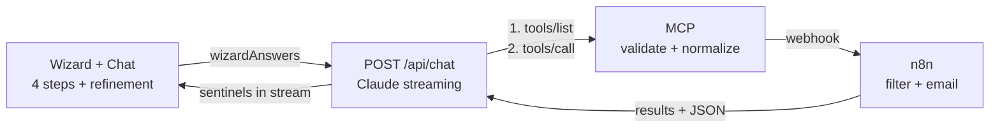

# Architecture

**Four-step wizard** → Claude (via MCP-validated tool) → n8n (filters `car_listings` Data Store) → up to 5 cards

**Three design decisions**:
1. Search tool lives in MCP, not Next.js
2. One Anthropic call; results never fed back to model
3. Streaming sentinels (`__SEARCH_STARTED__`, `__WEBHOOK_EVENT__`) in text stream

---

## System



---

## Request flow

1. User completes wizard, sends to `/api/chat`
2. Route fetches `search_cars` schema from MCP (60s cached)
3. Route calls Anthropic with schema + wizard context
4. Claude streams text + emits `tool_use search_cars`
5. Route intercepts: streams `__SEARCH_STARTED__` sentinel
6. Route calls MCP `tools/call` → validates filters
7. MCP POSTs to n8n webhook (5s timeout)
8. n8n: fetch all rows → AND-filter → return results
9. Route streams `__WEBHOOK_EVENT__{status, results, totalCount}`
10. Client: parse JSON, show up to 5 cards

**Key**: Model never sees results. All display logic is React.

---

## Streaming protocol

```
<Claude text>
__SEARCH_STARTED__
<silent gap while n8n runs>
__WEBHOOK_EVENT__{"status":"success", "results":[…], "totalCount":N}
```

Client finds earliest marker, renders prefix until close, then splits on `__WEBHOOK_EVENT__` and parses JSON tail. Four outcomes: success → show results; failed → show error + retry button; malformed JSON → show text; no sentinel → plain conversation.

---

## MCP: search_cars tool

**Input**: 14 fields (3 required: `transmission`, `usageContext`, `endTrigger`)

**Validation**: enums match n8n (hatchback/saloon/estate/suv/coupe; petrol/diesel/hybrid/electric); budgetMax > 0; yearMin ≤ yearMax ∈ [1900, currentYear+1]; minSeats ≥ 1

**Execution**: validate → POST webhook (5s) → normalize

**Normalization**: non-object or missing `results` → error; items missing make/model/year → dropped; optional fields → null

**Errors**: all map to `status: 'failed'`

---

## n8n: Car Search Logger

Webhook `/webhook/car-search`, exported to `n8n/car-search-workflow.json`

**Data Store** `car_listings`: ~12 seed rows (id, make, model, year, price, mileage, fuelType, bodyType, transmission, seatCount, colour, condition, features, source)

**Filter**: AND-logic; only mandatory features enforced; `"any"` / `[]` are no-ops

**Output**: email if valid address; return results + totalCount as JSON

---

## Frontend

| Component | Purpose |
|---|---|
| `CarBuyingAssistant.tsx` | wires hooks; owns modals |
| `ChatPanel.tsx` | chat drawer |
| `Results.tsx` | cards (up to 5) |
| `wizard/*.tsx` | 4 steps |
| `useWizardFlow.ts` | step/answer state |
| `useConversation.ts` | streaming; sentinels; results |

Two hooks, one-way dependency: `useConversation` → `onSearchResolved` → `useWizardFlow.jumpToResults()`.

One `useEffect` (autoscroll); rest event-driven.

---

## Data types

```
WizardAnswers → SearchFilters → CarSearchPayload → n8n → WebhookEvent
```

- `WizardAnswers`, `Message` → `lib/types/chat.ts`
- `SearchFilters` → `mcp-server/types.ts`
- `CarSearchPayload`, `WebhookEvent` → `lib/types/n8n.ts`
- `VehicleResult`, `ErrorEnvelope` → `lib/types/mcp.ts`
- `SENTINEL_*` → `lib/constants/sentinels.ts`

---

## Config

| Var | Purpose |
|---|---|
| `ANTHROPIC_API_KEY` | Claude auth |
| `MCP_SERVER_URL` | endpoint |
| `MCP_SERVER_PORT` | bind |
| `N8N_WEBHOOK_CAR_SEARCH_URL` | webhook |
| `N8N_WEBHOOK_AUTH_TOKEN` | optional Bearer |

Docker: `http://n8n:5678/webhook/car-search` (not localhost). No `NEXT_PUBLIC_*`; no secrets in browser.

---

## How the architecture evolved

| # | Feature | Why it exists |
|---|---|---|
| 001 | `app-skeleton-setup` | Next.js shell: single-page chat UI, 404, responsive layout |
| 002 | `ai-chatbot-integration` | wire the UI to Claude with token streaming and error handling |
| 003 | `n8n-integration` | stand up self-hosted n8n; fire-and-forget POST per chat turn |
| 004 | `smart-conversation-webhook` | **replace per-message firing with a structured tool call** — one `CarSearchPayload` at session end instead of a webhook per turn |
| 005 | `webhook-db-search` | give n8n something to search: `car_listings` Data Store + filter Code node |
| 006 | `expert-advisor-mode` | rewrite the system prompt so the model infers specs from lifestyle instead of interrogating the user |
| 007 | `email-notification-results` | HTML result email via n8n Send Email |
| 008 | `chat-search-feedback` | **the sentinel protocol** — n8n responds with a body, `__SEARCH_STARTED__` / `__WEBHOOK_EVENT__` bring results back into the chat |
| 009 | `mcp-vehicle-search` | **insert MCP as a validation boundary** between model and n8n; `search_cars` |
| 010 | `new-design-live-integration` | replace the chat-first page with the five-step wizard; feed `wizardAnswers` into `/api/chat` |
| 011 | `mcp-canonical-tool-layer` | route fetches tool schemas via `listTools()` each request — **MCP registry becomes the single source of truth** |
| 012 | `codebase-cleanup` | fix gaps: split monolith into components + hooks, guard every `JSON.parse`, route the retry through MCP, version-control the n8n workflow, delete dead code |

---
