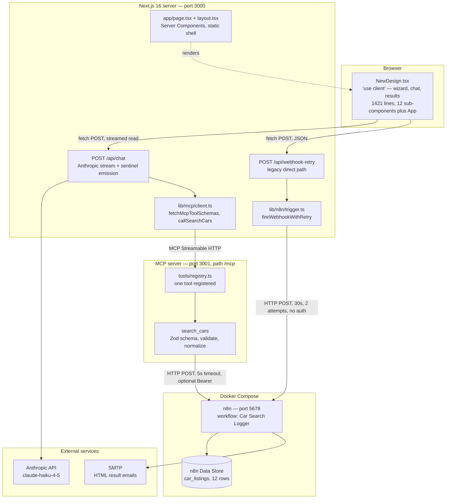
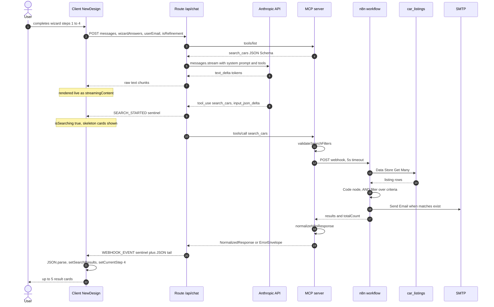
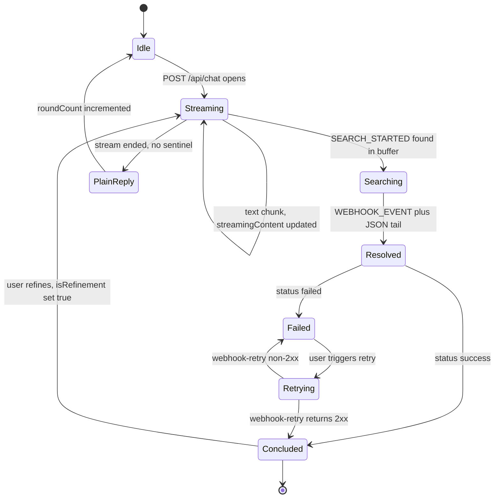
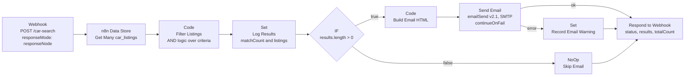
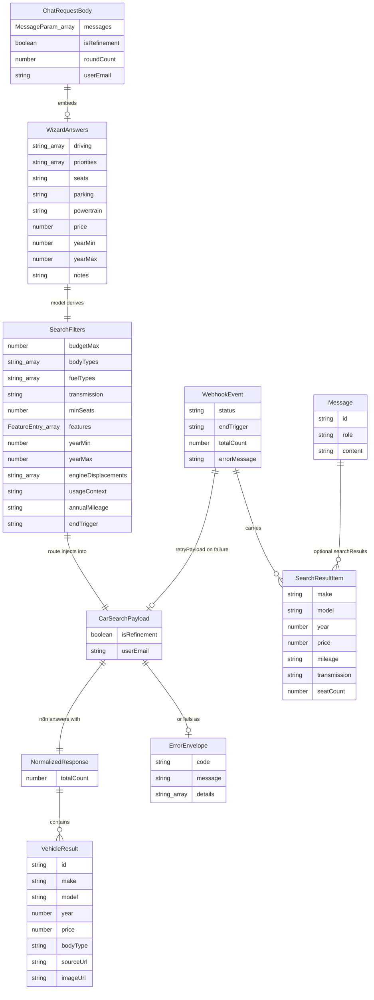
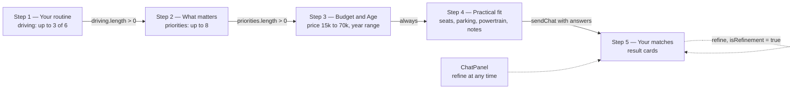

# Architecture — AI Car Buying Assistant

## 1. What this is

A guided car-shopping assistant. The user answers four short lifestyle questions in a wizard
("What does a normal week on the road look like?" rather than "What engine displacement?"), and
an LLM translates those answers into structured search filters, runs a vehicle search, and
returns a shortlist. The in-app assistant is named **Cora**.

The value flow:

```
wizard (4 steps)  →  Claude builds filters  →  MCP validates  →  n8n filters listings
                  →  email full list        →  step 5 shows top 5 cards in the UI
```

Two design decisions dominate everything else in this document:

1. **The search tool lives behind an MCP server**, not inside the Next.js route. The route asks
   the MCP server for the tool's JSON Schema at request time, so the schema has exactly one
   definition (`mcp-server/tools/search-cars.ts`).
2. **There is no agentic tool loop.** One Anthropic streaming call happens per request, and the
   search result is *never* fed back to the model as a `tool_result`. 

---

## 2. System at a glance



The **Next.js app is not in Docker Compose** — only `n8n` and `mcp-server` are. In practice the
app and often the MCP server run on the host while n8n runs in a container.

---

## 3. Processes, ports, and how to run

| Process | Entry point | Port | Command |
|---|---|---|---|
| Next.js 16 App Router, React 19 | `app/` | 3000 | `npm run dev` |
| MCP server | `mcp-server/index.ts` | 3001, path `/mcp` | `npm run dev:mcp` |
| n8n | `docker-compose.yml` | 5678 | `docker compose up` |
| Anthropic API | — | — | model `claude-haiku-4-5`, `max_tokens: 1500` |
| SMTP | — | — | credential configured in the n8n UI only |

`npm run dev:mcp` is `tsx --env-file=.env.local mcp-server/index.ts` (`package.json:9`) — the MCP
server reads env directly from `.env.local`, it does not go through Next.js.

There is no build step for the MCP server in either dev or Docker; `mcp-server/Dockerfile` runs
`npx tsx mcp-server/index.ts` and copies `lib/` in because `mcp-server/` imports from it.

**Startup order matters.** The chat route calls `fetchMcpToolSchemas()` before it calls Anthropic
(`app/api/chat/route.ts:89`), and that function *throws* if `MCP_SERVER_URL` is unset. If the MCP
server is down, every chat request fails with HTTP 502 `api_error` — the app has no
tool-less fallback.

---

## 4. Request lifecycle



Note steps 3–4: **two separate MCP round trips per chat request**, each opening and closing a
fresh transport (see §6).

### The system prompt

`buildSystemPrompt(isRefinement, wizardAnswers)` (`app/api/chat/route.ts:10-48`) has four
branches, selected by the two flags. All four share the same base — *"You are a car buying
advisor. Only engage with car-related topics"* — and all four push hard toward calling the tool
immediately rather than conversing:

| `wizardAnswers` | `isRefinement` | Behaviour |
|---|---|---|
| yes | yes | one sentence confirming the adjustment, then `search_cars` with updated params |
| yes | no | `search_cars` immediately; no questions unless the notes are ambiguous |
| no | yes | one sentence confirming, then `search_cars`; no further questions |
| no | no | one sentence, then `search_cars` using only mentioned params; rest `null`/`"any"` |

When wizard answers are present they are interpolated as a plain-text preferences block
(`app/api/chat/route.ts:13-23`) — driving patterns, priorities, budget, year range, seats, parking,
powertrain, notes. This is why the wizard exists: it front-loads the information the model would
otherwise have to ask for, so the very first turn can call the tool.

---

## 5. The streaming sentinel protocol

This is the least obvious part of the system and the thing worth understanding first.

`/api/chat` returns `Content-Type: text/plain; charset=utf-8` wrapping a raw `ReadableStream`
(`app/api/chat/route.ts:153-155`). **It is not SSE, not JSON, not newline-delimited JSON.**
Control information is smuggled into the text stream as two magic strings:

```
<Claude's text tokens, enqueued verbatim>          route.ts:115
\n\n__SEARCH_STARTED__                             route.ts:128  (before callSearchCars)
   … silent gap while MCP → n8n runs …
\n\n__WEBHOOK_EVENT__{"status":"success", …}       route.ts:143-145
```

Both literals are declared once on each side of the wire:
`components/NewDesign.tsx:48-49` and `app/api/chat/route.ts:128,144`. They are *not* shared
constants — the strings are duplicated across the client/server boundary.

### How the client decodes it

`sendChat()` (`components/NewDesign.tsx:1096-1114`) reads with `response.body.getReader()` and a
`TextDecoder`, accumulating into one buffer. On every chunk it finds the **earliest** of the two
markers and renders only the prefix:

```ts
const webhookIdx = accumulated.indexOf(SENTINEL);
const searchStartedIdx = accumulated.indexOf(SEARCH_STARTED_SENTINEL);
const markers = [webhookIdx, searchStartedIdx].filter((i) => i !== -1);
const firstMarker = markers.length > 0 ? Math.min(...markers) : -1;
const displayContent = firstMarker !== -1 ? accumulated.slice(0, firstMarker) : accumulated;
setStreamingContent(displayContent);
setIsSearching(searchStartedIdx !== -1);
```

After the stream closes (`components/NewDesign.tsx:1116-1192`) it splits on `__WEBHOOK_EVENT__` and
`JSON.parse`s the tail into a `WebhookEvent`. Three outcomes:

- **`status: 'success'`** — commit prefix text as an assistant message, `setSearchResults`,
  `setTotalResultCount`, `setSessionStatus('concluded')`, jump to `setCurrentStep(4)`.
- **`status: 'failed'`** — stash `retryPayload` in `retryPayloadRef`, show `webhookError` with a
  retry affordance.
- **No sentinel at all** — the whole buffer becomes an assistant message and `roundCount`
  increments. This is the plain-conversation path.

### Protocol state machine



### Why this shape, and what it costs

The route intercepts the tool call mid-stream and resolves it server-side, so the user sees
Claude's confirmation sentence immediately and a loading state during the n8n round trip —
without a second model call. The trade-off is that the model has no knowledge of the results: it
cannot rank them, explain them, or answer follow-up questions about them. All presentation logic
lives in React (`Results`, `components/NewDesign.tsx:632-775`).

A consequence worth knowing: because a `JSON.parse` failure on the tail falls through to the
"treat it as an assistant message" branch (`components/NewDesign.tsx:1169-1180`), a malformed
`__WEBHOOK_EVENT__` payload surfaces as the raw JSON text appearing in the chat bubble.

---

## 6. The MCP layer

### Server

`mcp-server/index.ts` is a bare `node:http` server, not a framework:

- Requests to any path other than `/mcp` get a 404 (`mcp-server/index.ts:18-21`).
- Transport is `StreamableHTTPServerTransport` with `sessionIdGenerator: undefined`, i.e. **fully
  stateless** — no session IDs, no shared state (`mcp-server/index.ts:33`).
- A **new `McpServer` and a new transport are constructed per HTTP request** (`mcp-server/index.ts:32-33`),
  both closed on `res.close` (`mcp-server/index.ts:35-38`).
- Server identity: `name: 'vehicle-search-mcp-server', version: '1.0.0'` (`mcp-server/index.ts:9-12`).
- Every request is logged as `[mcp] → <method> (<toolName>)` (`mcp-server/index.ts:30`).

### Registry

`mcp-server/tools/registry.ts` is six lines and delegates to one registration function. Tool
name → handler dispatch happens entirely inside the MCP SDK; there is no custom dispatch map.

```ts
export function registerTools(server: McpServer): void {
  registerSearchCarsTool(server);
}
```

Adding a tool means writing a `register*Tool(server)` function and adding one line here. It then
appears automatically in the model's tool list, because the route fetches schemas via
`listTools()` rather than hard-coding them.

### Client

`lib/mcp/client.ts` exposes two functions, and **neither caches or pools connections** — each
builds a fresh `Client` + `StreamableHTTPClientTransport`, connects, acts, and closes in a
`finally` block (`lib/mcp/client.ts:18-31`, `lib/mcp/client.ts:44-68`).

`fetchMcpToolSchemas()` performs the MCP → Anthropic schema conversion, which is a pure
property rename with no transformation:

```ts
return tools.map((tool) => ({
  name: tool.name,
  description: tool.description,
  input_schema: tool.inputSchema as Anthropic.Tool['input_schema'],
}));
```

### The `search_cars` tool

Input schema — 14 Zod fields (`mcp-server/tools/search-cars.ts:28-62`). Only three are required:

| Field | Type | Req. | Notes |
|---|---|:--:|---|
| `budgetMax` | `number \| null` | | maximum budget in euros |
| `bodyTypes` | `string[]` | | `["any"]` for no constraint |
| `fuelTypes` | `string[]` | | |
| `transmission` | `'manual' \| 'automatic' \| 'any'` | ● | |
| `minSeats` | `number \| null` | | |
| `features` | `{ name, mandatory }[]` | | mandatory vs nice-to-have |
| `yearMin` / `yearMax` | `number \| null` | | |
| `engineDisplacements` | `string[]` | | e.g. `["1.5","2.0"]` |
| `usageContext` | `'commute' \| 'family' \| 'offroad' \| 'performance' \| 'any'` | ● | |
| `annualMileage` | `string \| null` | | e.g. `"10000-15000"` |
| `endTrigger` | `'explicit' \| 'implicit' \| 'length-limit' \| 'refinement' \| 'unknown'` | ● | provenance of the call |
| `isRefinement` | `boolean` | | *"Injected by route handler — not filled by Claude"* |
| `userEmail` | `string \| null` | | *"Injected by route handler — not filled by Claude"* |

The last two are in the schema the model sees but are described as route-injected. The route does
in fact overwrite them (`app/api/chat/route.ts:129`), so a model-supplied value is discarded.

**Allowed enum members**, enforced by `validateSearchFilters` (`mcp-server/tools/search-cars.ts:6-26`):

- body types — `hatchback saloon estate suv crossover mpv coupe convertible any`
- fuel types — `petrol diesel hybrid mild-hybrid plugin-hybrid electric any`
- displacements — `1.0 1.2 1.4 1.5 1.6 1.8 2.0 2.5 3.0 any`

Validation (`mcp-server/tools/search-cars.ts:81-149`) collects *all* errors before returning: `budgetMax > 0`,
enum membership, years integral within `[1900, currentYear + 1]`, `yearMin <= yearMax`,
`minSeats` integer `>= 1`, non-empty feature names. This is the layer spec 009 introduced — the
whole reason the MCP server exists is to stop malformed model output from reaching n8n.

**Execution** (`mcp-server/tools/search-cars.ts:151-265`): log a filter summary → validate → read
`N8N_WEBHOOK_CAR_SEARCH_URL` → build a `CarSearchPayload` with `?? null` / `?? ['any']` defaults
→ POST with `AbortSignal.timeout(5000)` and an optional `Authorization: Bearer` header →
normalize.

**Normalization** (`mcp-server/tools/search-cars.ts:267-334`) is defensive at the top level: non-object bodies and
a missing `results` array become `SCHEMA_MISMATCH`, and individual items missing a string `make`,
string `model`, or numeric `year` are **dropped with a warning** rather than failing the request.
`totalCount` falls back to `results.length` when absent — so `totalCount` can legitimately exceed
`results.length` when n8n reports a larger total than it returns.

**Error envelope** (`lib/types/mcp.ts:24-28`), discriminated by `isErrorEnvelope`:

| `code` | Cause |
|---|---|
| `VALIDATION_ERROR` | filters failed `validateSearchFilters` |
| `N8N_UNREACHABLE` | webhook URL unset, or network error |
| `TIMEOUT` | n8n exceeded 5 seconds |
| `N8N_ERROR` | n8n returned non-2xx |
| `SCHEMA_MISMATCH` | body not JSON, not an object, or no `results` array |

The route maps any envelope to `WebhookEvent { status: 'failed', errorMessage, retryPayload }`
(`app/api/chat/route.ts:130-136`), so all five codes surface to the user as one retryable error.

---

## 7. The n8n workflow

Workflow name **"Car Search Logger"**, webhook path `/webhook/car-search`.

> **Caveat:** the only workflow JSON committed to the repo is spec 003's two-node skeleton
> (`specs/003-n8n-integration/car-search-workflow.json`, still `responseMode: onReceived`).
> Everything below is reconstructed from the plans of specs 005, 007, and 008. The live graph
> exists only inside the `n8n_data` Docker volume. See gap 3 in §13.



| Node | Type | Role |
|---|---|---|
| Webhook | `n8n-nodes-base.webhook` v2 | entry; `responseMode: responseNode` so the caller gets a body back (changed from `onReceived` in spec 008) |
| Data Store Get Many | `n8n-nodes-base.n8nTable` | reads **all** `car_listings` rows; no read-time filter |
| Code: Filter Listings | `n8n-nodes-base.code` v2 | AND-logic filter; `"any"` / `[]` criteria are no-ops; only **mandatory** features are enforced |
| Set: Log Results | `n8n-nodes-base.set` | surfaces `matchCount` + `listings` in the execution view |
| IF: Check Has Results | `n8n-nodes-base.if` | branches on `results.length > 0` |
| Code: Build Email HTML | `n8n-nodes-base.code` v2 | table-based XHTML email: criteria summary + one card per listing |
| Send Email | `n8n-nodes-base.emailSend` v2.1 | subject `"Your car matches: N result(s) found"`; `continueOnFail: true` so delivery failure never fails the search |
| Set: Record Email Warning | `n8n-nodes-base.set` | error branch of Send Email |
| NoOp | `n8n-nodes-base.noOp` | false branch; skip email |
| Respond to Webhook | `n8n-nodes-base.respondToWebhook` | terminal; returns `{ status, results, totalCount }` |

### The "database"

There is **no external database**. Storage is n8n's built-in **Data Store**, one table
`car_listings` with 12 seed rows, read-only at runtime and seeded manually through the n8n UI
(`specs/005-webhook-db-search/contracts/car-search-data-store.md`).

Columns: `id, make, model, year, price, mileage, fuelType, bodyType, transmission, seatCount,
colour, condition, features` (JSON string array)`, source`. Enums: `fuelType ∈ {petrol, diesel,
hybrid, electric}`, `bodyType ∈ {hatchback, suv, saloon, estate, coupe}`,
`transmission ∈ {manual, automatic}`, `condition ∈ {new, used}`.

Note the Data Store's fuel and body enums are **narrower** than the MCP tool's accepted values —
`crossover`, `mpv`, `convertible`, `mild-hybrid`, and `plugin-hybrid` pass MCP validation but can
never match a row.

---

## 8. Data model



Where each type lives, and the boundary it crosses:

| Type | File | Crosses |
|---|---|---|
| `WizardAnswers`, `Message`, `MessageParam`, `ChatRequestBody`, `ChatErrorType` | `lib/types/chat.ts` | browser ↔ route |
| `SearchFilters`, `VehicleResult` | `mcp-server/types.ts` | **imported by the Next.js side** (`lib/mcp/client.ts:4`) — this file crosses the process boundary |
| `CarSearchPayload`, `SearchResultItem`, `WebhookEvent`, `FeatureEntry`, `WebhookResult`, `TriggerLogEntry` | `lib/types/n8n.ts` | route ↔ MCP ↔ n8n ↔ browser |
| `NormalizedResponse`, `ErrorEnvelope`, `isErrorEnvelope`, `normalizeSearchResultItem` | `lib/types/mcp.ts` | MCP ↔ route |

`VehicleResult` is declared **twice** with different shapes: `mcp-server/types.ts:18-26` has 7
fields, `lib/types/mcp.ts:3-17` has 13. The 13-field version is the one actually used; the
`mcp-server/types.ts` copy is unreferenced.

`SearchResultItem` and the 13-field `VehicleResult` are structurally identical except that
`VehicleResult` adds a synthesized `id` of the form `` `${make}-${model}-${year}` ``.

---

## 9. Frontend structure

The entire UI is one client component. `app/page.tsx` is five lines and does nothing but render
it; there is no server-side data fetching anywhere.



The gate is `canContinue` (`components/NewDesign.tsx:989-993`) — steps 1 and 2 require a non-empty
selection, steps 3 and 4 always pass. `continueFlow()` fires `sendChat('', answers)` on the
`3 → 4` transition (`components/NewDesign.tsx:1243-1245`); the search *is* the step-5 transition.
`maxStep` allows backward navigation only to already-visited steps.

### Sub-components (all in `components/NewDesign.tsx`)

| Component | Lines | Purpose |
|---|---|---|
| `Logo` | 129 | brand mark, `compact` variant |
| `AppSidebar` | 148 | desktop step nav (`lg:flex`) + reset |
| `MobileNav` | 222 | mobile drawer, same nav + backdrop |
| `ChoiceCard` | 308 | animated multi-select tile |
| `SegmentedControl` | 349 | pill picker, shared-element `layoutId` |
| `StepOne` … `StepFour` | 380, 414, 520, 583 | the four wizard steps |
| `DualRangeSlider` | 459 | overlaid dual range inputs for year min/max |
| `Results` | 632 | skeletons, empty state, `items.slice(0, 5)` cards, heart-save |
| `ChatPanel` | 777 | chat drawer; owns `draft` and the autoscroll ref |
| `App` | 963 | default export; owns all shared state |

### State

All shared state is in `App` — 18 `useState` hooks plus 3 refs, no reducer, no context, no store:

- **Navigation** — `currentStep`, `maxStep`, `chatOpen`, `menuOpen`
- **Form** — `answers` (a `WizardAnswers`), `submittedWizardAnswers` (snapshot at submit time, so
  later refinements still carry the original profile)
- **Conversation** — `messages`, `isStreaming`, `streamingContent`, `error`, `sessionStatus`,
  `roundCount`, `isRefinement`
- **Search** — `webhookError`, `isSearching`, `searchResults`, `totalResultCount`, `userEmail`
- **Refs** — `chatInputRef`, `abortControllerRef` (cancels the in-flight `/api/chat` fetch on
  reset), `retryPayloadRef` (holds the failed `CarSearchPayload`)

There is exactly **one `useEffect` in the whole file** — autoscroll inside `ChatPanel`
(`components/NewDesign.tsx:807-809`). Everything else is event-driven. `isStreaming` and `isSearching`
combine into `resultsLoading` (`components/NewDesign.tsx:1253`) to drive the skeleton cards.

Notably, the wizard-triggered message is **synthetic**: the string
`'Find me the best matching cars based on my profile.'` is appended to the outgoing API messages
but never stored in `messages` (`components/NewDesign.tsx:1021-1023, 1061-1068`), so it never appears in the
chat transcript. Conversation history sent upstream is capped at the last 20 messages with
result-bearing messages filtered out.

### Styling

Tailwind v4 via `@import "tailwindcss"` in `components/newdesign.css`, imported globally from
`app/layout.tsx`. PostCSS uses only `@tailwindcss/postcss`. Animation is `framer-motion`, icons
are `lucide-react`. `app/page.module.css` is orphaned.

---

## 10. Configuration

| Variable | Read by | Purpose |
|---|---|---|
| `ANTHROPIC_API_KEY` | `app/api/chat/route.ts:7` | Anthropic SDK auth |
| `MCP_SERVER_URL` | `lib/mcp/client.ts:13,35` | where Next.js reaches MCP, e.g. `http://localhost:3001/mcp` |
| `MCP_SERVER_PORT` | `mcp-server/index.ts:6` | MCP bind port, default `3001` |
| `N8N_WEBHOOK_CAR_SEARCH_URL` | `mcp-server/tools/search-cars.ts:175`, `app/api/webhook-retry/route.ts:5` | n8n webhook endpoint |
| `N8N_WEBHOOK_AUTH_TOKEN` | `mcp-server/tools/search-cars.ts:205` | optional `Bearer` token — **MCP path only** |

`.env.local` defines all five. In Compose, `mcp-server` receives `MCP_SERVER_PORT=3001` and
`N8N_WEBHOOK_CAR_SEARCH_URL=http://n8n:5678/webhook/car-search` — the n8n **service hostname**,
not `localhost`. No `N8N_WEBHOOK_AUTH_TOKEN` is passed in Compose, so containerized runs send
unauthenticated webhook requests.

No `NEXT_PUBLIC_*` variables exist; no secret reaches the browser.

---

## 11. How the architecture evolved

The repo uses Spec-Kit: `specs/NNN-name/{spec,plan,data-model,research,tasks}.md` plus
`contracts/`. Read as a sequence, the specs explain why each layer exists.

| # | Feature | Why it exists |
|---|---|---|
| 001 | `app-skeleton-setup` | Next.js shell: single-page chat UI, 404, responsive layout |
| 002 | `ai-chatbot-integration` | wire the UI to Claude with token streaming and error handling |
| 003 | `n8n-integration` | stand up self-hosted n8n; fire-and-forget POST per chat turn |
| 004 | `smart-conversation-webhook` | **replace per-message firing with a structured tool call** — one `CarSearchPayload` at session end instead of a webhook per turn |
| 005 | `webhook-db-search` | give n8n something to search: `car_listings` Data Store + filter Code node |
| 006 | `expert-advisor-mode` | rewrite the system prompt so the model infers specs from lifestyle instead of interrogating the user |
| 007 | `email-notification-results` | HTML result email via n8n Send Email |
| 008 | `chat-search-feedback` | **the sentinel protocol** — n8n responds with a body, `__SEARCH_STARTED__` / `__WEBHOOK_EVENT__` bring results back into the chat |
| 009 | `mcp-vehicle-search` | **insert MCP as a validation boundary** between model and n8n; `search_cars` |
| 010 | `new-design-live-integration` | replace the chat-first page with the five-step wizard; feed `wizardAnswers` into `/api/chat` |
| 011 | `mcp-canonical-tool-layer` | route fetches tool schemas via `listTools()` each request — **MCP registry becomes the single source of truth** |

The through-line is progressive tightening of the model's authority: from "the model chats and we
fire a webhook every turn" (003) → "the model emits one structured payload" (004) → "a separate
process validates that payload before anything downstream sees it" (009) → "that process also
owns the schema the model is shown" (011).

---

## 12. Constitution constraints

`.specify/memory/constitution.md` (v1.0.0, ratified 2026-08-04) governs this codebase and
supersedes conflicting conventions. Condensed:

- **I. Clean Code** — self-explanatory identifiers; extract deeply nested logic; delete dead code
  immediately; Prettier-enforced formatting; **no commented-out code in committed files**.
- **II. Simple UX** — fewest possible steps; progressive disclosure; human-readable actionable
  errors, never raw technical output; defaults represent the common path.
- **III. Responsive Design** — correct at ≥320px, ≥768px, ≥1280px; fluid relative units;
  touch targets ≥44×44px; no horizontal scroll; mobile-first.
- **IV. Minimal Dependencies** — every dependency justified against: does the project already
  cover this, can a small custom implementation replace it, is it maintained and CVE-free.
- **V. No Automated Testing** — **no unit, integration, e2e, or snapshot suites; no test runners
  as dependencies; no CI test steps.** Quality comes from review and manual verification.

Stack rules: latest stable Next.js/React at feature start; App Router and Server Components
only; Pages Router and `getServerSideProps` forbidden; TypeScript everywhere; each unavoidable
`any` must carry a `// TODO: remove any` comment.

Principle V explains the absence of any `test/` directory, and is why §14 below is a manual
checklist rather than a test command.

---

## 13. Known gaps and drift

Observations from reading the code, not a work order.

1. **The MCP server binds loopback, so its published Docker port cannot work.**
   `mcp-server/index.ts:44` is `httpServer.listen(PORT, '127.0.0.1')`, while
   `docker-compose.yml` publishes `3001:3001`. Docker's proxy connects to the *container's* IP,
   not the container's loopback, so nothing can reach the process through the published port.
   Local `npm run dev:mcp` works fine, which is why this stays hidden. Binding `0.0.0.0` would
   fix it.

2. **Two divergent paths to n8n.** `/api/chat` goes through MCP: validated, 5-second timeout,
   optional Bearer auth. `/api/webhook-retry` calls `fireWebhookWithRetry` directly: unvalidated,
   30-second timeout, 2 attempts, **no auth header** (`lib/n8n/trigger.ts:18-24`). A retry
   therefore does not exercise the same code path as the original request, which cuts against
   spec 009's premise that MCP is *the* boundary to n8n.

3. **The live n8n workflow is not version-controlled.** Only spec 003's two-node skeleton is
   committed. The Data Store node, filter Code node, IF branch, email nodes, and Respond to
   Webhook — everything specs 005–008 added — exist solely in the `n8n_data` Docker volume.
   Losing the volume loses the workflow, and there is no exported JSON to restore from.

4. **A retry discards the results it fetched.** `/api/webhook-retry` returns
   `{ status, results, totalCount }`, but `retryWebhook()` (`components/NewDesign.tsx:1218-1222`) only sets
   `sessionStatus = 'concluded'` on success — it never calls `setSearchResults`. A successful
   retry clears the error without showing any cars.

5. **`roundCount` is dead over the wire.** The client sends it (`components/NewDesign.tsx:1077`) and
   `ChatRequestBody` declares it, but `app/api/chat/route.ts:58-62` never reads it. The client still
   increments it locally.

6. **`ConversationState.consecutiveRefusals`** (`lib/types/chat.ts`) has no corresponding
   `useState` and is never tracked. `ConversationState` and `ChatInterfaceProps` as a whole are
   unused leftovers — the real state lives as individual hooks in `App`.

7. **`VehicleResult` is defined twice.** `mcp-server/types.ts:18-26` (7 fields) is dead;
   `lib/types/mcp.ts:3-17` (13 fields) is live.

8. **`normalizeN8nResponse` guards only three fields.** `make`, `model`, and `year` get `typeof`
   checks; `bodyType`, `price`, and `sourceUrl` get guarded casts; but `mileage`, `features`,
   `fuelType`, `seatCount`, `transmission`, and `imageUrl` are unchecked `as` casts
   (`mcp-server/tools/search-cars.ts:316-321`). A missing field arrives as `undefined` even though the type
   promises `string | null`, and the UI renders that gap rather than a null fallback.

9. **`app/not-found.tsx`** styles reference `var(--color-*)` custom properties that
   `components/newdesign.css` never defines — leftovers from the design system removed in spec 010.

10. **Constitution I violation:** a commented-out `//console.log(result)` remains at
    `mcp-server/tools/search-cars.ts:262`.

11. **Per-request MCP connection churn.** Two connect/close cycles per chat turn (`listTools`,
    then `callTool`), each with a fresh transport (`lib/mcp/client.ts`). Correct but adds two
    round trips of latency; caching the schema would remove one.

12. **Enum mismatch between MCP and the Data Store.** `crossover`, `mpv`, `convertible`,
    `mild-hybrid`, and `plugin-hybrid` pass MCP validation but match no `car_listings` row (§7).
    The user gets a silent zero-result search rather than an explanation.

13. **Spec status fields are stale.** Only 007 says `Implemented`; 009, 010, and 011 still say
    `Draft` despite their code being merged.

---

## 14. Verification

Automated tests are forbidden by constitution principle V, so verification is manual.

**Startup**

```bash
docker compose up -d          # n8n on :5678
npm run dev:mcp               # MCP server on :3001 — use this, not the Compose one (gap 1)
npm run dev                   # Next.js on :3000
```

**End-to-end happy path**

1. Open `http://localhost:3000`, complete steps 1–4, click through to step 5.
2. Watch the MCP server log: expect `[mcp] → tools/list`, then
   `[mcp] → tools/call (search_cars)`, then `[search_cars] invoked — …` with a filter summary,
   then `[search_cars] ✓ N result(s) returned`.
3. In the browser Network tab, inspect the `/api/chat` response as raw text. Confirm the frame
   order from §5: prose, `__SEARCH_STARTED__`, then `__WEBHOOK_EVENT__` with a JSON tail.
4. Confirm the UI shows skeleton cards during the gap, then up to 5 result cards.
5. Check the n8n execution log for `matchCount`, and the inbox for the result email if an email
   was supplied.

**Failure paths**

- Stop the MCP server and send a chat message → expect HTTP 502 and the `api_error` copy.
- Stop n8n and search → expect `N8N_UNREACHABLE`, surfaced as `webhookError` with a retry option.
- Send an out-of-enum body type → expect `VALIDATION_ERROR` with per-field `details`.

**Responsive check (constitution III)** — verify at 320px, 768px, and 1280px: the sidebar
switches to `MobileNav` below `lg`, no horizontal scroll appears, and touch targets stay ≥44px.

**Document maintenance** — the numbers here (ports, timeouts, model id, sentinel literals, line
references) are the parts most likely to rot. When touching `app/api/chat/route.ts`,
`lib/mcp/client.ts`, `mcp-server/index.ts`, or `docker-compose.yml`, re-check §3, §5, §6, and
§10.
